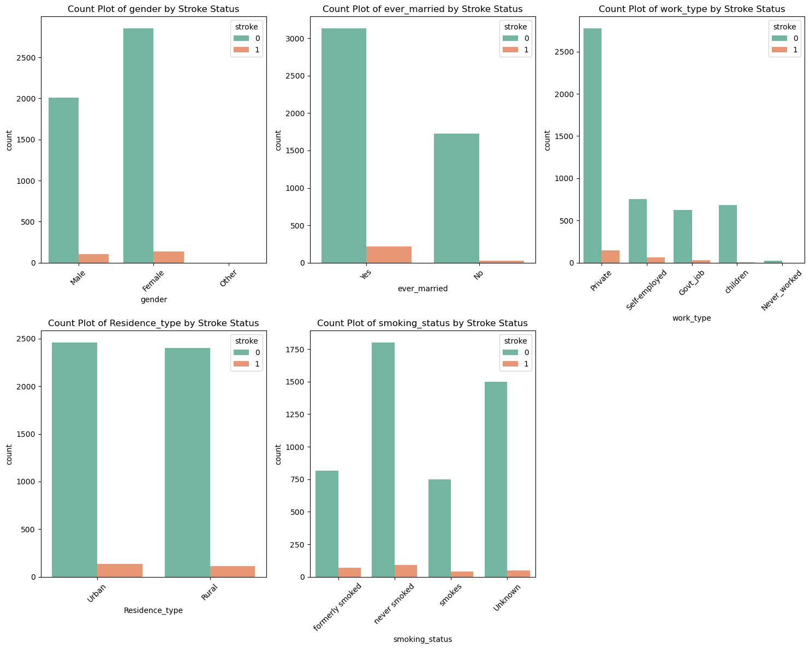
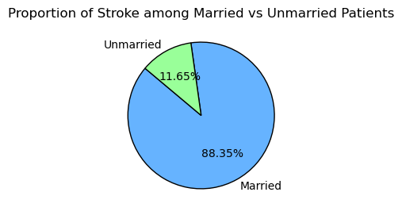
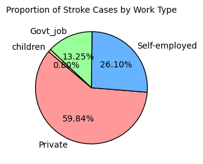
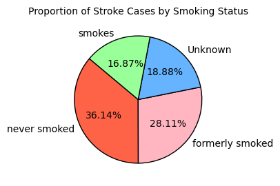

# Team 7 

## Content

* [Overview](#overview)
* [Goals](#goals)
* [Techniques](#techniques)
    + [Models](#models)
* [Key Findings](#findings)
* [Visuals](#visuals)
* [Contacts](#contacts)

## Overview 
This repository focuses on solving a classification problem -  **A Stroke Prediction**. According to the World Health Organization (WHO), stroke is the second leading cause of death worldwide. In this project, we train multiple machine learning models on a relevant dataset to predict the likelihood of stroke. The goal is to identify key features that influence stroke risk and develop an accurate predictive model for better healthcare outcomes.

The Kaggle stroke dataset consists of a collection of data from 5110 individuals. Each record represents an individual’s demographic, health, and lifestyle information, along with whether they had a stroke or not. Key variables in the dataset include:

* Age: The age of the individual.
* Gender: The gender of the individual.
* Hypertension: Whether the individual has a history of hypertension.
* Heart Disease: Whether the individual has a history of heart disease.
* Ever Married: Whether the individual is married or not.
* Work Type: The type of employment the individual has (e.g., private, self-employed, government, etc.).
* Residence Type: The type of area where the individual resides (urban or rural).
* Average Glucose Level: The individual’s glucose level (indicating potential metabolic issues).

* BMI: The body mass index, a key indicator of weight-related health risks.
* Smoking Status: Whether the individual smokes and the extent of their smoking habits.

## Goals
 To identify key features that influence stroke risk and develop an accurate predictive model for better healthcare outcomes

## Techniques
Before preceedings to the training the model, we understand the data and perform the preprocessing. During the pre-processing, we update the missing numeric values with its mean, categorize the non-numeric values, and standardize the numeric ones.

### Models

## Key Findings

## Visuals

### Exploratory data anlysis

  #### Class distribution of stroke

  This bar plot shows the distribution of the target variable 'Stroke' across the dataset. As observed, the class distribution is highly imbalanced, where out of 5110 individuals, 4861 (95.13%) are non-stroke and 249 (4.87%) are susceptible to stroke.

#### Plots of non-numeric columns by stroke status:

* Comparing stroke rates between genders: 

    It is observed that the risk of stroke in both males and females are almost same - 4.71% fpr females and 5.11% for males.

* Stroke likelihood based on marital status:

    From the plots it is observed that among the married individuals 6.56% and among unmarried ones 1.65% had a stroke. This shows that, in the dataset, the proportion of individuals who had a stroke is higher among married individuals than unmarried individuals.
    
    Considering all patients who had stroke, 88.35% of them are married and 11.84% are unmarried, as demonstrated in the pie chart. This indicates a correlation between marital status and stroke probability, with stroke rate being significantly higher among married individuals compared to unmarried ones. 

    

* Proportion of stroke by residence type:

  From the plots it is observed that 54.22% of the individuals who had a stroke are from urban areas and 45.78% from rural areas. The urban population has a slightly higher proportion of stroke cases compared to the rural population, but the difference is not very large. This might indicate that other factors (such as age, preexisting health conditions, etc.) could be contributing to stroke cases in urban areas.

* Proportion of stroke by work type:

  The distribution of stroke cases based on work type shows that 59.84% work private, 26.10% are self-employed, 13.25% are government job holders with the other categories 'children' and 'never worked' are negligible. It is observed that the 'private' sector has the largest proportion of stroke cases, 'self-employed' group also makes up a substantial portion, while 'Govt_job' has a smaller contribution.

  

* Stroke probability based on smoking status:

  From the smoking status distribution it is observed that among the patients who suffered a stroke, 36.14%  never smoked, 28.11% formerly smoked, 18.88% have unknown smoking status and 16.87% currently smokes. The largest proportion of stroke cases come from people who have never smoked, which might be surprising but the combined proportion of stroke patients who previously smoked or currently smokes is quite significant, which indicates a strong correlation between smoking and stroke status.

  

#### Histograms of Age and Average Glucose Level and BMI 

#### Scatterplots of Age vs Average Glucose Level and BMI 

#### Pie charts of stroke probability for people with heart disease and hypertension

## Contacts

* Rui Qian Sun
* Catherine Liang
* Mahbub Khandoker
* Neethila Poddar
* Devangi Vyas