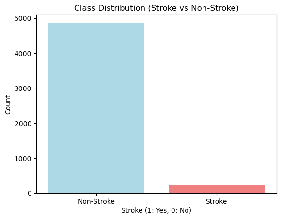
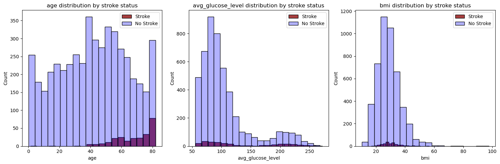
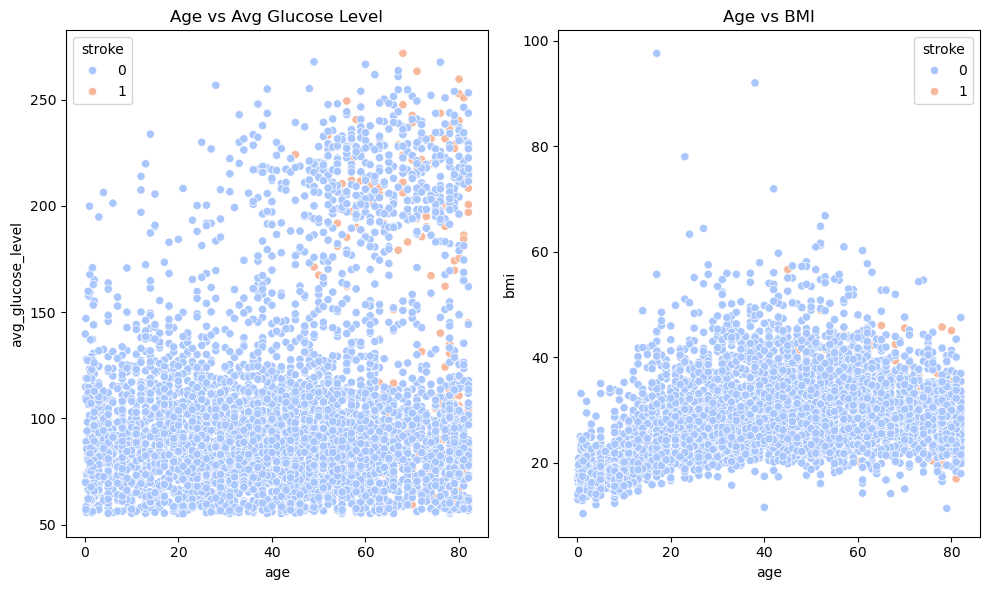
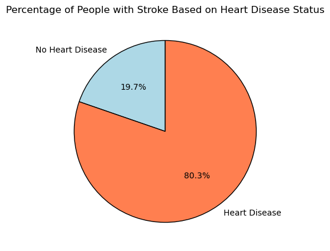
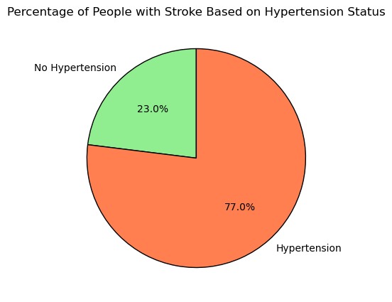

# Team 7 

## Content

* [Purpose & Overview](#purpose--overview)
* [Goals & Objectives](#goals--objectives)
* [Techniques & Technologies](#techniques--technologies)
* [Key Findings & Instructions](#keyfindings--instructions)
* [Visuals & Credits](#visuals--contacts)

## Purpose & Overview
This project focuses on determing which variables significantly predict the occurence of stroke. Our dataset consists of 11 variables for 5,110 patients, including the variable "stroke" which is 1 if a patient had a stroke or 0 otherwise. The remaining variables represent a patient's demographic, health, and lifestyle information.

* Age: age of patient
* Gender: gender of patient
* Hypertension: whether the patient has a hypertension
* Heart Disease: whether the patient has heart disease
* Ever Married: whether the patient is married
* Work Type: the type of employment the patient has
* Residence Type: the type of area where the patient resides
* Average Glucose Level: the patient's average glucose level
* BMI: the body mass index of the patient
* Smoking Status: the patient's smoking history/status

Business Problem:
We are a data science team working on stroke prevention. Our job is to advise public health decision makers on which factors significantly predict the occurence of stroke and use that to inform the population at risk who should receive stroke prevention treatment.

Industry Context:
In 2021, stroke was one of the top 5 leading causes of death in Canada, responsible for 37 deaths per 100,000 people. Being able to identify predictors of stroke plays a critical role in stroke prevention for the healthcare industry.

1. Early Detection: 
The ability to predict a stroke before it happens leads to more opportunities to prevent the stroke through lifestyle changes and prevention treatments.
      
2. Targeted Treatment:
Identifying which factors predict stroke aides healthcare professional with developing treatments and intervetions for strokes.

## Goals & Objectives
The project aims to develop a reliable model to predict stroke and identify associated key features. Our goal is to create a model with high accuracy, precision, recall, and F1 scores.

Change: Due to class imbalance in the dataset, we were unable to achieve a high F1 score, so we pivoted our modelling approach to optimize for recall instead of F1. The rationale for a high recall model is that false positives (predicting a stroke for a non-stroke patient) are less harmful than false negatives (predicting no stroke for a patient that suffers a stroke).

## Techniques & Technologies
The data used for this project was the Stroke Prediction Dataset from https://www.kaggle.com/datasets/fedesoriano/stroke-prediction-dataset?resource=download

Analyses were performed using Python 3.9.15 in Jupyter notebooks.

The libraries used in this project were pandas, numpy, scikit-learn, shap, statsmodels, matplotlib, and random. Seeds and random states can be found in the notebooks in the model folder. <mark>[TEAM PLEASE ADD LIBRARIES THAT I MIGHT HAVE MISSED] </mark>

Preprocessing
- Imputation: Simple imputation (using the mean) was performed on BMI, since only a small proportion of values (4%) were missing from the dataset. About 30% of the smoking status variable was labeled was "Unknown". We experimented with random imputation but decided to leave smoking status as is because imputing such a large proportion of data would lead to bias and might not represent the true data distribution. Thus, the interpretation of smoking status is a limitation of this analysis.
- Outliers: There was 1 observation with Other gender, which was grouped with Male gender to reduce noise. Observations with "children" as the work type was grouped with the "never worked" category.
- Standard Scaling was done on the numerical variables age, bmi, and average glucose level
- Categorical variables were one-hot encoded.

Techniques & Metrics
- The dataset was split using train_test_split from sklearn.model_selection.
- Grid search was used for hyperparameter tuning of the models.
- Performance metrics include accuracy, precision, recall, F1, and ROC AUC (Receiver Operating Characteristic - Area Under the Curve). 
- <mark>cross validation</mark>
- The features of the models were examined with feature importance and SHAP value plots.

Models
- Since this is a classification problem, the processed data was first fit into a logistic regression model with balanced class weights to adjust for data imbalance. VIF values were checked and no collinearity was detected. All of the non-outcome variables were fit into the model. The model accuracy was 0.7456, F1 score was 0.2353, recall: 0.80, precision was 0.1379, and ROC AUC was 0.8436. Tuning of hyperparameters was also done using sklearn's GridSearchCV to optimize for recall, metrics from the best model are shown in the table below.

- decision tress (grid seach class_weights)
- xgboost (class weight vs scale pos weight)?

## Key Findings & Instructions
No setup instructions are required.

F1 attempts, accuracy, precision, recall, and f1 for stroke 1 and 0 results
-> subsetting the data

compare the metrics of each model F1 vs Recall, in a table, create an excel
Metrics (f1 vs recall side be side)
- accuracy, precision, recall, F1
- cross validation
- ROC AUC
- feature importance
- SHAP
- explanation in real world terms

| Metric | Logistic Regression | XGBoost Model |
|----------|----------|----------|
| Accuracy | 0.6624 | Row 1, Column 3 |
| Precision | precision 0.1108 | Row 2, Column 3 |
| F1 Score | 0.1958 | Row 3, Column 3 |
| Recall | 0.84 | Row 3, Column 3 |
| ROC AUC | 0.8336 | Row 3, Column 3 |

key factors, for each variable in our model do we agree or disagree with the SHAP and feature importance, use reasoning and EDA, what is our final answer to "which variable predict strokes"?

Based on SHAP summaries of the tuned and untuned logistic regression models, the most important features were age, glucose level, work type, hypertension, and smoking status.
<mark>[RUI ADD IMPORTANT FACTORS FROM XGBOOST] </mark>

The distribution of age by stroke status shows that prevalence increases with age.

Risks, Unknowns, & Limitations

Limitation: Due to the rare outcome of stroke in this dataset, it was challenging to optimize on several performance metrics. Our final models showed good recall and AUC scores (over 0.8 in the logistic regression model and over 0.9 in the XGBoost model). Due to the various health conditions among individuals for a stroke to occure, it might not be possible to predict the timing of a stroke. However, we were able to find several key factors that would put one at the risk of a stroke, with age being the most important. 

Limitation: It may not be possible to prevent a stroke even if you can predict it

Unknown: The financial cost of a potential stroke prevention treatment

Unknown: The source of the dataset is unknown, and might not be representative of the distribution in the population. Although, the 4% stroke outcome seen in this dataset is similar to the 3% prevalence in Canadian adults, according to the Public Health Agency of Canada (hyperlink https://health-infobase.canada.ca/ccdss/data-tool/). 

Unknown: The dataset lacks information on other health conditions and lifestyle facotrs which have been found to be highly associated with strokes, including prior stroke history, transcient ischemic attack history, blood cholesterol, alcohol consumption, etc. (hyperlink source: https://www.hopkinsmedicine.org/health/conditions-and-diseases/stroke)

Unknown: The dataset is cross-sectional. We only chose stroke as the outcome because that's our business problem. However, the outcome could be other variables such as hypertension and heart disease. Thus we cannot determine causal relationship between stroke and the other variables, only associations.

Risk: Depending on the prevention effort on individuals who are incorrectly predicted to have a stroke according to our model, the risk of implementing our modelling results would be the balance between harm and benefit in the prevention. For example, if the prevention strategy had negative side effects, or could be dangerous and invasive, the model results should not be used because of its low precision (which was the cost of high recall). Since our business case is focused on insights for public health decision makers, the prevention strategy is likely to be one implemented at the upstream level such as patient education efforts (e.g. smoking cessation, diet and exercise), increasing primary care, and managing other health conditions.

## Visuals
EDA visuals, upload PNG files to repo

### Exploratory data anlysis

  #### Class distribution of stroke

  This bar plot shows the distribution of the target variable Stroke across the dataset. As observed, the class distribution is imbalanced, with a larger proportion of individuals who did not have a stroke compared to those who had one.

* Histograms of Age and Average Glucose Level and BMI 

* Scatterplots of Age vs Average Glucose Level and BMI 

* Pie charts of stroke probability for people with heart disease and hypertension

## Credits and links to videos

* Rui Qian Sun
* Catherine Liang
* Mahbub Khandoker
* Neethila Poddar
* Devangi Vyas

